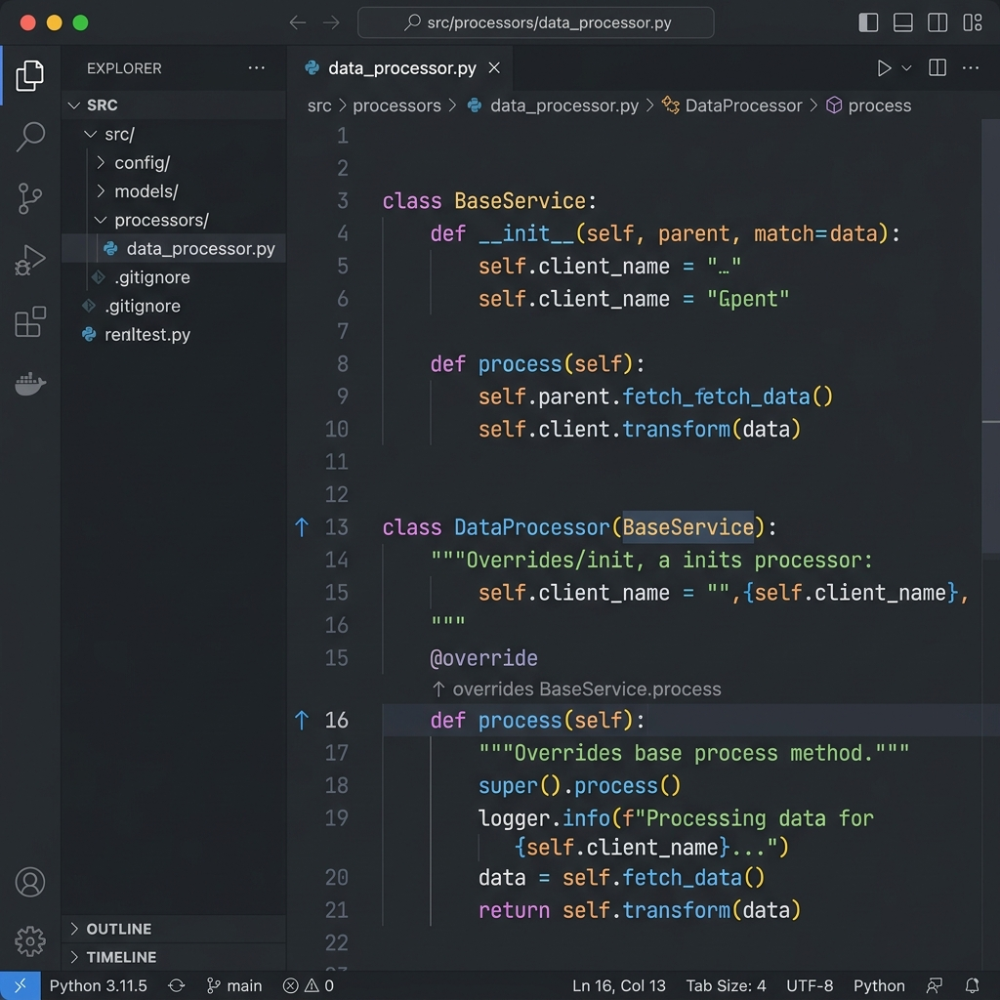
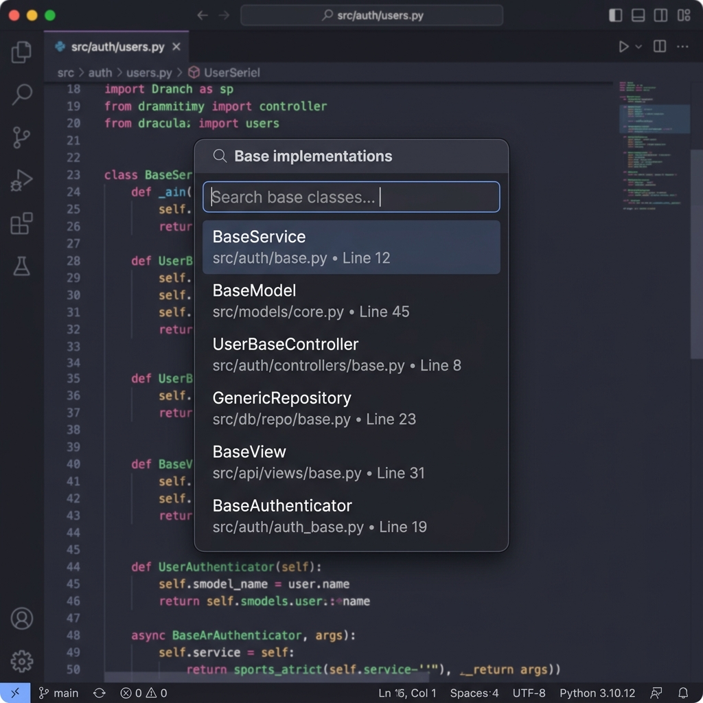

# Python Inheritance Visualizer 🐍✨

[](https://opensource.org/licenses/MIT)

Визуализируйте наследование классов и переопределение методов в Python прямо на полях вашего редактора. Аналог функционала PyCharm для VS Code и Cursor.



## Основные возможности

- **Gutter Icons**: Иконки на полях (↑, ↓, ↕) позволяют мгновенно увидеть, переопределен ли метод и имеет ли он свои реализации в подклассах.
- **CodeLens Ссылки**: Наглядные полупрозрачные ссылки над определением метода для быстрого перехода к родителям или наследникам.
- **Информативное меню**: Переход к целям с отображением имен классов и относительных путей к файлам.
  
- **Мгновенная работа**: Умное кэширование и фоновая индексация всего проекта на основе графа классов.
- **Кросс-файловая поддержка**: Отслеживание наследования между разными модулями проекта.

## Живой пример

Представьте, что у вас есть два файла:

### `base.py`
```python
class BaseService:
    def process(self):  # [↓ overridden in 1 subclasses]
        print("Базовая обработка")
```

### `service.py`
```python
from base import BaseService

class PaymentService(BaseService):
    def process(self):  # [↑ overrides BaseService.process]
        print("Обработка платежа")
        super().process()
```

В редакторе над методом `process` появятся кликабельные надписи: 
- В `base.py`: `↓ overridden in 1 subclasses`
- В `service.py`: `↑ overrides BaseService.process (base.py)`

## Как это работает (Под капотом)
Расширение строит **высокопроизводительный граф наследований** всего проекта. В отличие от других инструментов, оно не перегружает Language Server (Pylance) запросами по каждому методу, а вычисляет связи в памяти, что гарантирует плавную работу даже на больших проектах.

## Установка

1. Скачайте `.vsix` файл из [Releases](https://github.com/KorotkoVladimir/vscode-inheritance/releases).
2. В VS Code выполните команду: `Extensions: Install from VSIX...`.
3. Откройте любой Python-проект и дождитесь завершения первичной индексации (уведомление в углу).

## Требования
- Расширение **Python** (ms-python.python)
- Языковой сервер **Pylance** (рекомендуется)

## Лицензия
Данный проект распространяется под лицензией MIT. Подробности в файле [LICENSE](LICENSE).

---
Создано с любовью для Python-разработчиков. ❤️
